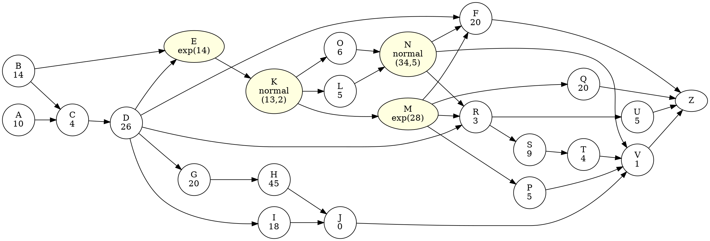

```dot  
digraph G {
    
A[label="A\n10"]
B[label="B\n14"]
C[label="C\n4"]
D[label="D\n26"]
E[label="E\nexp(14)", fillcolor=lightyellow, style=filled]
F[label="F\n20"]
G[label="G\n20"]
H[label="H\n45"]
I[label="I\n18"]
J[label="J\n7"]
K[label="K\nnormal\n(13,2)", fillcolor=lightyellow, style=filled]
L[label="L\n5"]
M[label="M\nexp(28)", fillcolor=lightyellow, style=filled]
N[label="N\nnormal\n(34,5)", fillcolor=lightyellow, style=filled]
O[label="O\n6"]
P[label="P\n5"]
Q[label="Q\n20"]
R[label="R\n3"]
S[label="S\n9"]
T[label="T\n4"]
U[label="U\n5"]
V[label="V\n1"]
J[label="J\n0"]


    rankdir=LR;
    A
    B
    {A,B} -> C
    {C} -> D
    {D,B} -> E
    {D,M,N} -> F
    {D} -> G
    {G} -> H
    {D} -> I
    {I,H} -> J
    {E} -> K
    {K} -> L
    {K} -> M
    {L,O} -> N
    {K} -> O
    {M} -> P
    {M} -> Q
    {D,M,N} -> R
    {R} -> S
    {S} -> T
    {R} -> U
    {J,T,P,N} -> V
    {V,U,Q,F} -> Z
}
```
