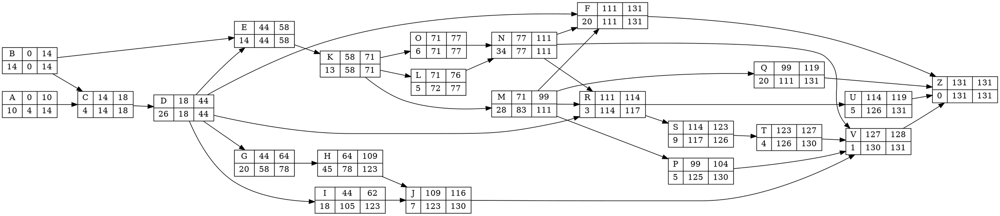

indianred


```dot
digraph structs {
rankdir=LR;
node [shape=record];

A [label=" { { A | 10 } | {   0 |   4 } | {  10 |  14 } }", style=filled, fillcolor=lightyellow]; 
B [label=" { { B | 14 } | {   0 |   0 } | {  14 |  14 } }", style=filled, fillcolor=indianred]; 
C [label=" { { C |  4 } | {  14 |  14 } | {  18 |  18 } }", style=filled, fillcolor=indianred]; 
D [label=" { { D | 26 } | {  18 |  18 } | {  44 |  44 } }", style=filled, fillcolor=indianred]; 
E [label=" { { E | 14 } | {  44 |  44 } | {  58 |  58 } }", style=filled, fillcolor=indianred]; 
F [label=" { { F | 20 } | { 111 | 111 } | { 131 | 131 } }", style=filled, fillcolor=indianred]; 
G [label=" { { G | 20 } | {  44 |  58 } | {  64 |  78 } }", style=filled, fillcolor=lightyellow]; 
H [label=" { { H | 45 } | {  64 |  78 } | { 109 | 123 } }", style=filled, fillcolor=lightyellow]; 
I [label=" { { I | 18 } | {  44 | 105 } | {  62 | 123 } }", style=filled, fillcolor=lightyellow]; 
J [label=" { { J |  7 } | { 109 | 123 } | { 116 | 130 } }", style=filled, fillcolor=lightyellow]; 
K [label=" { { K | 13 } | {  58 |  58 } | {  71 |  71 } }", style=filled, fillcolor=indianred]; 
L [label=" { { L |  5 } | {  71 |  72 } | {  76 |  77 } }", style=filled, fillcolor=lightyellow]; 
M [label=" { { M | 28 } | {  71 |  83 } | {  99 | 111 } }", style=filled, fillcolor=lightyellow]; 
N [label=" { { N | 34 } | {  77 |  77 } | { 111 | 111 } }", style=filled, fillcolor=indianred]; 
O [label=" { { O |  6 } | {  71 |  71 } | {  77 |  77 } }", style=filled, fillcolor=indianred]; 
P [label=" { { P |  5 } | {  99 | 125 } | { 104 | 130 } }", style=filled, fillcolor=lightyellow]; 
Q [label=" { { Q | 20 } | {  99 | 111 } | { 119 | 131 } }", style=filled, fillcolor=lightyellow]; 
R [label=" { { R |  3 } | { 111 | 114 } | { 114 | 117 } }", style=filled, fillcolor=lightyellow]; 
S [label=" { { S |  9 } | { 114 | 117 } | { 123 | 126 } }", style=filled, fillcolor=lightyellow]; 
T [label=" { { T |  4 } | { 123 | 126 } | { 127 | 130 } }", style=filled, fillcolor=lightyellow]; 
U [label=" { { U |  5 } | { 114 | 126 } | { 119 | 131 } }", style=filled, fillcolor=lightyellow]; 
V [label=" { { V |  1 } | { 127 | 130 } | { 128 | 131 } }", style=filled, fillcolor=lightyellow]; 
Z [label=" { { Z |  0 } | { 131 | 131 } | { 131 | 131 } }", style=filled, fillcolor=indianred]; 
{} -> A 
{} -> B 
{A,B} -> C 
{C} -> D 
{D,B} -> E 
{D,M,N} -> F 
{D} -> G 
{G} -> H 
{D} -> I 
{I,H} -> J 
{E} -> K 
{K} -> L 
{K} -> M 
{L,O} -> N 
{K} -> O 
{M} -> P 
{M} -> Q 
{D,M,N} -> R 
{R} -> S 
{S} -> T 
{R} -> U 
{J,T,P,N} -> V 
{V,U,Q,F} -> Z 
}
```


1
1
1
1
1
1
1
1
1
1
1
1
1
1
1
1
1
1
1
1
1
1
1
1
1
1
1
1
1
1
1
1
1
1
1



```dot
digraph structs {
rankdir=LR;
node [shape=record];

A [label=" { { A | 10 } | {   0 |   4 } | {  10 |  14  } }"]; 
B [label=" { { B | 14 } | {   0 |   0 } | {  14 |  14  } }"]; 
C [label=" { { C |  4 } | {  14 |  14 } | {  18 |  18  } }"]; 
D [label=" { { D | 26 } | {  18 |  18 } | {  44 |  44  } }"]; 
E [label=" { { E | 14 } | {  44 |  44 } | {  58 |  58  } }"]; 
F [label=" { { F | 20 } | { 111 | 111 } | { 131 | 131  } }"]; 
G [label=" { { G | 20 } | {  44 |  58 } | {  64 |  78  } }"]; 
H [label=" { { H | 45 } | {  64 |  78 } | { 109 | 123  } }"]; 
I [label=" { { I | 18 } | {  44 | 105 } | {  62 | 123  } }"]; 
J [label=" { { J |  7 } | { 109 | 123 } | { 116 | 130  } }"]; 
K [label=" { { K | 13 } | {  58 |  58 } | {  71 |  71  } }"]; 
L [label=" { { L |  5 } | {  71 |  72 } | {  76 |  77  } }"]; 
M [label=" { { M | 28 } | {  71 |  83 } | {  99 | 111  } }"]; 
N [label=" { { N | 34 } | {  77 |  77 } | { 111 | 111  } }"]; 
O [label=" { { O |  6 } | {  71 |  71 } | {  77 |  77  } }"]; 
P [label=" { { P |  5 } | {  99 | 125 } | { 104 | 130  } }"]; 
Q [label=" { { Q | 20 } | {  99 | 111 } | { 119 | 131  } }"]; 
R [label=" { { R |  3 } | { 111 | 114 } | { 114 | 117  } }"]; 
S [label=" { { S |  9 } | { 114 | 117 } | { 123 | 126  } }"]; 
T [label=" { { T |  4 } | { 123 | 126 } | { 127 | 130  } }"]; 
U [label=" { { U |  5 } | { 114 | 126 } | { 119 | 131  } }"]; 
V [label=" { { V |  1 } | { 127 | 130 } | { 128 | 131  } }"]; 
Z [label=" { { Z |  0 } | { 131 | 131 } | { 131 | 131  } }"]; 
{} -> A 
{} -> B 
{A,B} -> C 
{C} -> D 
{D,B} -> E 
{D,M,N} -> F 
{D} -> G 
{G} -> H 
{D} -> I 
{I,H} -> J 
{E} -> K 
{K} -> L 
{K} -> M 
{L,O} -> N 
{K} -> O 
{M} -> P 
{M} -> Q 
{D,M,N} -> R 
{R} -> S 
{S} -> T 
{R} -> U 
{J,T,P,N} -> V 
{V,U,Q,F} -> Z 
}
```


```
 , style=filled, fillcolor=indianred 
```