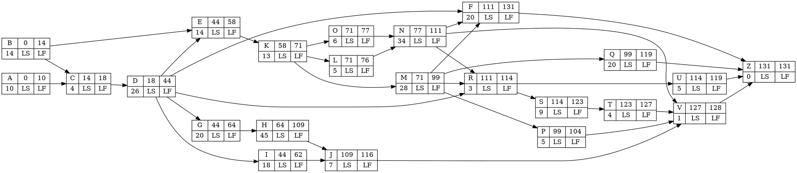

$Z_{i} = a \cdot Z_{i-1} + c \pmod{m}; \quad U_{i} = Z_{i}/m$

$m = 51; \quad a = 11; \quad c = 0$

$\begin{array}{ll}
Z_{0} = 5 \\
Z_{1} = 11 \cdot 5 + 0 \pmod{51} = 4 & U_{1} = 4/51 = 0.078 \\ 
Z_{2} = 11 \cdot 4 + 0 \pmod{51} = 44 & U_{2} = 44/51 = 0.863 \\ 
Z_{3} = 11 \cdot 44 + 0 \pmod{51} = 25 & U_{3} = 25/51 = 0.490 \\ 
Z_{4} = 11 \cdot 25 + 0 \pmod{51} = 20 & U_{4} = 20/51 = 0.392 \\ 
Z_{5} = 11 \cdot 20 + 0 \pmod{51} = 16 & U_{5} = 16/51 = 0.314 \\ 
Z_{6} = 11 \cdot 16 + 0 \pmod{51} = 23 & U_{6} = 23/51 = 0.451 \\ 
Z_{7} = 11 \cdot 23 + 0 \pmod{51} = 49 & U_{7} = 49/51 = 0.961 \\ 
Z_{8} = 11 \cdot 49 + 0 \pmod{51} = 29 & U_{8} = 29/51 = 0.569 \\ 
Z_{9} = 11 \cdot 29 + 0 \pmod{51} = 13 & U_{9} = 13/51 = 0.255 \\ 
Z_{10} = 11 \cdot 13 + 0 \pmod{51} = 41 & U_{10} = 41/51 = 0.804 \\ 
\end{array}$

$\begin{array}{ll}
Z_{0} = 15 \\
Z_{1} = 11 \cdot 15 + 0 \pmod{51} = 12 & U_{1} = 12/51 = 0.235 \\ 
Z_{2} = 11 \cdot 12 + 0 \pmod{51} = 30 & U_{2} = 30/51 = 0.588 \\ 
Z_{3} = 11 \cdot 30 + 0 \pmod{51} = 24 & U_{3} = 24/51 = 0.471 \\ 
Z_{4} = 11 \cdot 24 + 0 \pmod{51} = 9 & U_{4} = 9/51 = 0.176 \\ 
Z_{5} = 11 \cdot 9 + 0 \pmod{51} = 48 & U_{5} = 48/51 = 0.941 \\ 
Z_{6} = 11 \cdot 48 + 0 \pmod{51} = 18 & U_{6} = 18/51 = 0.353 \\ 
Z_{7} = 11 \cdot 18 + 0 \pmod{51} = 45 & U_{7} = 45/51 = 0.882 \\ 
Z_{8} = 11 \cdot 45 + 0 \pmod{51} = 36 & U_{8} = 36/51 = 0.706 \\ 
Z_{9} = 11 \cdot 36 + 0 \pmod{51} = 39 & U_{9} = 39/51 = 0.765 \\ 
Z_{10} = 11 \cdot 39 + 0 \pmod{51} = 21 & U_{10} = 21/51 = 0.412 \\ 
\end{array}$

$\begin{array}{ll}
Z_{0} = 25 \\
Z_{1} = 11 \cdot 25 + 0 \pmod{51} = 20 & U_{1} = 20/51 = 0.392 \\ 
Z_{2} = 11 \cdot 20 + 0 \pmod{51} = 16 & U_{2} = 16/51 = 0.314 \\ 
Z_{3} = 11 \cdot 16 + 0 \pmod{51} = 23 & U_{3} = 23/51 = 0.451 \\ 
Z_{4} = 11 \cdot 23 + 0 \pmod{51} = 49 & U_{4} = 49/51 = 0.961 \\ 
Z_{5} = 11 \cdot 49 + 0 \pmod{51} = 29 & U_{5} = 29/51 = 0.569 \\ 
Z_{6} = 11 \cdot 29 + 0 \pmod{51} = 13 & U_{6} = 13/51 = 0.255 \\ 
Z_{7} = 11 \cdot 13 + 0 \pmod{51} = 41 & U_{7} = 41/51 = 0.804 \\ 
Z_{8} = 11 \cdot 41 + 0 \pmod{51} = 43 & U_{8} = 43/51 = 0.843 \\ 
Z_{9} = 11 \cdot 43 + 0 \pmod{51} = 14 & U_{9} = 14/51 = 0.275 \\ 
Z_{10} = 11 \cdot 14 + 0 \pmod{51} = 1 & U_{10} = 1/51 = 0.020 \\ 
\end{array}$

$\begin{array}{ll}
Z_{0} = 35 \\
Z_{1} = 11 \cdot 35 + 0 \pmod{51} = 28 & U_{1} = 28/51 = 0.549 \\ 
Z_{2} = 11 \cdot 28 + 0 \pmod{51} = 2 & U_{2} = 2/51 = 0.039 \\ 
Z_{3} = 11 \cdot 2 + 0 \pmod{51} = 22 & U_{3} = 22/51 = 0.431 \\ 
Z_{4} = 11 \cdot 22 + 0 \pmod{51} = 38 & U_{4} = 38/51 = 0.745 \\ 
Z_{5} = 11 \cdot 38 + 0 \pmod{51} = 10 & U_{5} = 10/51 = 0.196 \\ 
Z_{6} = 11 \cdot 10 + 0 \pmod{51} = 8 & U_{6} = 8/51 = 0.157 \\ 
Z_{7} = 11 \cdot 8 + 0 \pmod{51} = 37 & U_{7} = 37/51 = 0.725 \\ 
Z_{8} = 11 \cdot 37 + 0 \pmod{51} = 50 & U_{8} = 50/51 = 0.980 \\ 
Z_{9} = 11 \cdot 50 + 0 \pmod{51} = 40 & U_{9} = 40/51 = 0.784 \\ 
Z_{10} = 11 \cdot 40 + 0 \pmod{51} = 32 & U_{10} = 32/51 = 0.627 \\ 
\end{array}$

rv1 - total: 5.177, avg: 0.518
rv2 - total: 5.529, avg: 0.553
rv3 - total: 4.884, avg: 0.488
rv4 - total: 5.233, avg: 0.523

Exponential Distribution
----

${\displaystyle F^{-1}(p;\lambda) = \frac{-\ln(1-p)}{\lambda} }$

1. Generate U from U[0,1]
2. Compue X = -log(1-U) / \lambda

$\lambda_1 = 0.0714$
$\begin{array}{ll}
X_{1} = (-\ln(1-U_{1}))/\lambda = (-\ln(1-0.219))/0.0714 = (-\ln(0.781))/0.0714 = (0.247)/0.0714 = 3.462 \\ 
X_{2} = (-\ln(1-U_{2}))/\lambda = (-\ln(1-0.41))/0.0714 = (-\ln(0.59))/0.0714 = (0.528)/0.0714 = 7.39 \\ 
X_{3} = (-\ln(1-U_{3}))/\lambda = (-\ln(1-0.514))/0.0714 = (-\ln(0.486))/0.0714 = (0.722)/0.0714 = 10.106 \\ 
X_{4} = (-\ln(1-U_{4}))/\lambda = (-\ln(1-0.653))/0.0714 = (-\ln(0.347))/0.0714 = (1.058)/0.0714 = 14.824 \\ 
X_{5} = (-\ln(1-U_{5}))/\lambda = (-\ln(1-0.187))/0.0714 = (-\ln(0.813))/0.0714 = (0.207)/0.0714 = 2.899 \\ 
X_{6} = (-\ln(1-U_{6}))/\lambda = (-\ln(1-0.06))/0.0714 = (-\ln(0.94))/0.0714 = (0.062)/0.0714 = 0.867 \\ 
X_{7} = (-\ln(1-U_{7}))/\lambda = (-\ln(1-0.657))/0.0714 = (-\ln(0.343))/0.0714 = (1.070)/0.0714 = 14.986 \\ 
X_{8} = (-\ln(1-U_{8}))/\lambda = (-\ln(1-0.231))/0.0714 = (-\ln(0.769))/0.0714 = (0.263)/0.0714 = 3.679 \\ 
X_{9} = (-\ln(1-U_{9}))/\lambda = (-\ln(1-0.542))/0.0714 = (-\ln(0.458))/0.0714 = (0.781)/0.0714 = 10.937 \\ 
X_{10} = (-\ln(1-U_{10}))/\lambda = (-\ln(1-0.96))/0.0714 = (-\ln(0.04))/0.0714 = (3.219)/0.0714 = 45.082 \\ 
\end{array}$

$\lambda_2 = 0.0357$
$\begin{array}{ll}
X_{1} = (-\ln(1-U_{1}))/\lambda = (-\ln(1-0.657))/0.0357 = (-\ln(0.343))/0.0357 = (1.070)/0.0357 = 29.973 \\ 
X_{2} = (-\ln(1-U_{2}))/\lambda = (-\ln(1-0.231))/0.0357 = (-\ln(0.769))/0.0357 = (0.263)/0.0357 = 7.358 \\ 
X_{3} = (-\ln(1-U_{3}))/\lambda = (-\ln(1-0.542))/0.0357 = (-\ln(0.458))/0.0357 = (0.781)/0.0357 = 21.874 \\ 
X_{4} = (-\ln(1-U_{4}))/\lambda = (-\ln(1-0.96))/0.0357 = (-\ln(0.04))/0.0357 = (3.219)/0.0357 = 90.165 \\ 
X_{5} = (-\ln(1-U_{5}))/\lambda = (-\ln(1-0.562))/0.0357 = (-\ln(0.438))/0.0357 = (0.826)/0.0357 = 23.124 \\ 
X_{6} = (-\ln(1-U_{6}))/\lambda = (-\ln(1-0.179))/0.0357 = (-\ln(0.821))/0.0357 = (0.197)/0.0357 = 5.525 \\ 
X_{7} = (-\ln(1-U_{7}))/\lambda = (-\ln(1-0.972))/0.0357 = (-\ln(0.028))/0.0357 = (3.576)/0.0357 = 100.155 \\ 
X_{8} = (-\ln(1-U_{8}))/\lambda = (-\ln(1-0.693))/0.0357 = (-\ln(0.307))/0.0357 = (1.181)/0.0357 = 33.079 \\ 
X_{9} = (-\ln(1-U_{9}))/\lambda = (-\ln(1-0.625))/0.0357 = (-\ln(0.375))/0.0357 = (0.981)/0.0357 = 27.474 \\ 
X_{10} = (-\ln(1-U_{10}))/\lambda = (-\ln(1-0.88))/0.0357 = (-\ln(0.12))/0.0357 = (2.120)/0.0357 = 59.391 \\ 
\end{array}$

$\begin{array}{c|c}
\text{Uniform} & \text{Exponential(14)} \\ \text{Random Number} & \text{Random Number} \\ \hline
0.219 &  3.462 \\ 
0.41 &  7.39 \\ 
0.514 &  10.106 \\ 
0.653 &  14.824 \\ 
0.187 &  2.899 \\ 
0.06 &  0.867 \\ 
0.657 &  14.986 \\ 
0.231 &  3.679 \\ 
0.542 &  10.937 \\ 
0.96 &  45.082 \\ 
\end{array}$

$\begin{array}{c|c}
\text{Uniform} & \text{Exponential(28)} \\ \text{Random Number} & \text{Random Number} \\ \hline
0.657 &  29.973 \\ 
0.231 &  7.358 \\ 
0.542 &  21.874 \\ 
0.96 &  90.165 \\ 
0.562 &  23.124 \\ 
0.179 &  5.525 \\ 
0.972 &  100.155 \\ 
0.693 &  33.079 \\ 
0.625 &  27.474 \\ 
0.88 &  59.391 \\ 
\end{array}$

$\begin{array}{ll} X = \mu + \sigma \sqrt{-2 \ln{U_{1}}} \cos{2\pi U_{2}}  \end{array}$

$\begin{array}{ll}
X_{1} = 13 + 2 \sqrt{-2 \ln({0.096})}  \cos({2\pi \cdot 0.534}) = 13 + 2 \sqrt{-2 \cdot (-2.343)} \cdot \cos(3.355) = 13 + 2 \sqrt{4.686} \cdot (-0.977) = 13 + 2 \cdot (2.165) \cdot (-0.977) = 8.77\\
X_{2} = 13 + 2 \sqrt{-2 \ln({0.052})}  \cos({2\pi \cdot 0.873}) = 13 + 2 \sqrt{-2 \cdot (-2.957)} \cdot \cos(5.485) = 13 + 2 \sqrt{5.914} \cdot (0.698) = 13 + 2 \cdot (2.432) \cdot (0.698) = 16.395\\
X_{3} = 13 + 2 \sqrt{-2 \ln({0.57})}  \cos({2\pi \cdot 0.598}) = 13 + 2 \sqrt{-2 \cdot (-0.562)} \cdot \cos(3.757) = 13 + 2 \sqrt{1.124} \cdot (-0.816) = 13 + 2 \cdot (1.06) \cdot (-0.816) = 11.27\\
X_{4} = 13 + 2 \sqrt{-2 \ln({0.267})}  \cos({2\pi \cdot 0.574}) = 13 + 2 \sqrt{-2 \cdot (-1.321)} \cdot \cos(3.607) = 13 + 2 \sqrt{2.642} \cdot (-0.894) = 13 + 2 \cdot (1.625) \cdot (-0.894) = 10.095\\
X_{5} = 13 + 2 \sqrt{-2 \ln({0.936})}  \cos({2\pi \cdot 0.311}) = 13 + 2 \sqrt{-2 \cdot (-0.066)} \cdot \cos(1.954) = 13 + 2 \sqrt{0.132} \cdot (-0.374) = 13 + 2 \cdot (0.363) \cdot (-0.374) = 12.728\\
X_{6} = 13 + 2 \sqrt{-2 \ln({0.299})}  \cos({2\pi \cdot 0.418}) = 13 + 2 \sqrt{-2 \cdot (-1.207)} \cdot \cos(2.626) = 13 + 2 \sqrt{2.414} \cdot (-0.87) = 13 + 2 \cdot (1.554) \cdot (-0.87) = 10.296\\
X_{7} = 13 + 2 \sqrt{-2 \ln({0.287})}  \cos({2\pi \cdot 0.602}) = 13 + 2 \sqrt{-2 \cdot (-1.248)} \cdot \cos(3.782) = 13 + 2 \sqrt{2.496} \cdot (-0.802) = 13 + 2 \cdot (1.58) \cdot (-0.802) = 10.466\\
X_{8} = 13 + 2 \sqrt{-2 \ln({0.155})}  \cos({2\pi \cdot 0.618}) = 13 + 2 \sqrt{-2 \cdot (-1.864)} \cdot \cos(3.883) = 13 + 2 \sqrt{3.728} \cdot (-0.738) = 13 + 2 \cdot (1.931) \cdot (-0.738) = 10.15\\
X_{9} = 13 + 2 \sqrt{-2 \ln({0.709})}  \cos({2\pi \cdot 0.793}) = 13 + 2 \sqrt{-2 \cdot (-0.344)} \cdot \cos(4.983) = 13 + 2 \sqrt{0.688} \cdot (0.267) = 13 + 2 \cdot (0.829) \cdot (0.267) = 13.443\\
X_{10} = 13 + 2 \sqrt{-2 \ln({0.801})}  \cos({2\pi \cdot 0.721}) = 13 + 2 \sqrt{-2 \cdot (-0.222)} \cdot \cos(4.53) = 13 + 2 \sqrt{0.444} \cdot (-0.181) = 13 + 2 \cdot (0.666) \cdot (-0.181) = 12.759\\
\end{array}$

$\begin{array}{c|c|c}
\text{Uniform} & \text{Uniform} & \text{Normal(13, 2)} \\ \text{Random Number} & \text{Random Number} & \text{Random Number} \\ \hline
0.096  & 0.534 &  8.77 \\ 
0.052  & 0.873 &  16.395 \\ 
0.57  & 0.598 &  11.27 \\ 
0.267  & 0.574 &  10.095 \\ 
0.936  & 0.311 &  12.728 \\ 
0.299  & 0.418 &  10.296 \\ 
0.287  & 0.602 &  10.466 \\ 
0.155  & 0.618 &  10.15 \\ 
0.709  & 0.793 &  13.443 \\ 
0.801  & 0.721 &  12.759 \\ 
\end{array}$

$\begin{array}{ll}
X_{1} = 34 + 5 \sqrt{-2 \ln({0.876})}  \cos({2\pi \cdot 0.315}) = 34 + 5 \sqrt{-2 \cdot (-0.132)} \cdot \cos(1.979) = 34 + 5 \sqrt{0.264} \cdot (-0.397) = 34 + 5 \cdot (0.514) \cdot (-0.397) = 32.98\\
X_{2} = 34 + 5 \sqrt{-2 \ln({0.641})}  \cos({2\pi \cdot 0.462}) = 34 + 5 \sqrt{-2 \cdot (-0.445)} \cdot \cos(2.903) = 34 + 5 \sqrt{0.89} \cdot (-0.972) = 34 + 5 \cdot (0.943) \cdot (-0.972) = 29.417\\
X_{3} = 34 + 5 \sqrt{-2 \ln({0.056})}  \cos({2\pi \cdot 0.084}) = 34 + 5 \sqrt{-2 \cdot (-2.882)} \cdot \cos(0.528) = 34 + 5 \sqrt{5.764} \cdot (0.864) = 34 + 5 \cdot (2.401) \cdot (0.864) = 44.372\\
X_{4} = 34 + 5 \sqrt{-2 \ln({0.614})}  \cos({2\pi \cdot 0.92}) = 34 + 5 \sqrt{-2 \cdot (-0.488)} \cdot \cos(5.781) = 34 + 5 \sqrt{0.976} \cdot (0.876) = 34 + 5 \cdot (0.988) \cdot (0.876) = 38.327\\
X_{5} = 34 + 5 \sqrt{-2 \ln({0.749})}  \cos({2\pi \cdot 0.124}) = 34 + 5 \sqrt{-2 \cdot (-0.289)} \cdot \cos(0.779) = 34 + 5 \sqrt{0.578} \cdot (0.712) = 34 + 5 \cdot (0.76) \cdot (0.712) = 36.706\\
X_{6} = 34 + 5 \sqrt{-2 \ln({0.239})}  \cos({2\pi \cdot 0.359}) = 34 + 5 \sqrt{-2 \cdot (-1.431)} \cdot \cos(2.256) = 34 + 5 \sqrt{2.862} \cdot (-0.633) = 34 + 5 \cdot (1.692) \cdot (-0.633) = 28.645\\
X_{7} = 34 + 5 \sqrt{-2 \ln({0.629})}  \cos({2\pi \cdot 0.944}) = 34 + 5 \sqrt{-2 \cdot (-0.464)} \cdot \cos(5.931) = 34 + 5 \sqrt{0.928} \cdot (0.939) = 34 + 5 \cdot (0.963) \cdot (0.939) = 38.521\\
X_{8} = 34 + 5 \sqrt{-2 \ln({0.924})}  \cos({2\pi \cdot 0.386}) = 34 + 5 \sqrt{-2 \cdot (-0.079)} \cdot \cos(2.425) = 34 + 5 \sqrt{0.158} \cdot (-0.754) = 34 + 5 \cdot (0.397) \cdot (-0.754) = 32.503\\
X_{9} = 34 + 5 \sqrt{-2 \ln({0.167})}  \cos({2\pi \cdot 0.251}) = 34 + 5 \sqrt{-2 \cdot (-1.79)} \cdot \cos(1.577) = 34 + 5 \sqrt{3.58} \cdot (-0.006) = 34 + 5 \cdot (1.892) \cdot (-0.006) = 33.943\\
X_{10} = 34 + 5 \sqrt{-2 \ln({0.841})}  \cos({2\pi \cdot 0.761}) = 34 + 5 \sqrt{-2 \cdot (-0.173)} \cdot \cos(4.782) = 34 + 5 \sqrt{0.346} \cdot (0.069) = 34 + 5 \cdot (0.588) \cdot (0.069) = 34.203\\
\end{array}$

$\begin{array}{c|c|c}
\text{Uniform} & \text{Uniform} & \text{Normal(34, 5)} \\ \text{Random Number} & \text{Random Number} & \text{Random Number} \\ \hline
0.876  & 0.315 &  32.98 \\ 
0.641  & 0.462 &  29.417 \\ 
0.056  & 0.084 &  44.372 \\ 
0.614  & 0.92 &  38.327 \\ 
0.749  & 0.124 &  36.706 \\ 
0.239  & 0.359 &  28.645 \\ 
0.629  & 0.944 &  38.521 \\ 
0.924  & 0.386 &  32.503 \\ 
0.167  & 0.251 &  33.943 \\ 
0.841  & 0.761 &  34.203 \\ 
\end{array}$

