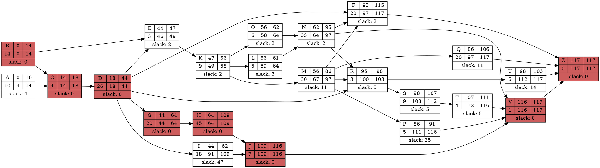
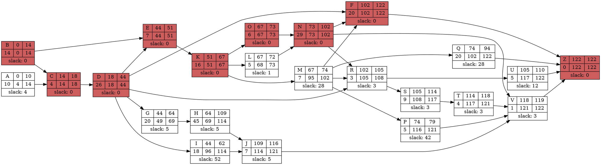
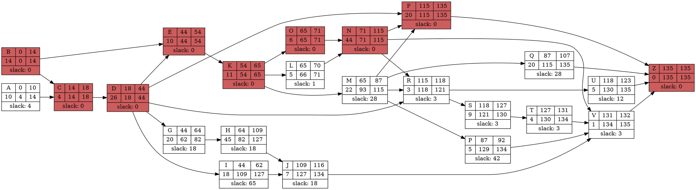
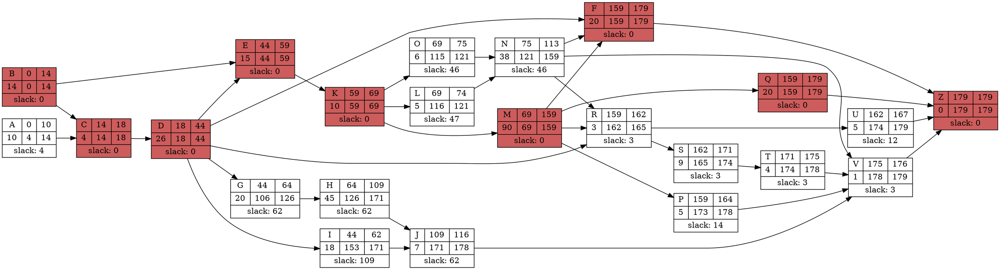
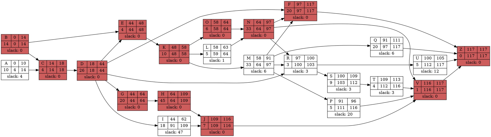
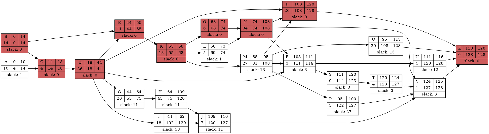
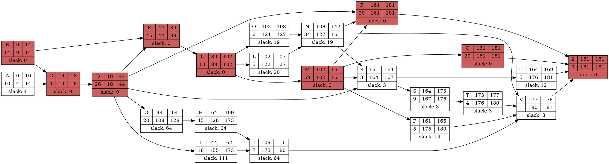

$\begin{array}{ll}
Z_{1} = 11 \cdot 5 + 0 \pmod{251} = 55 & U_{1} = 55/251 = 0.219 \\ 
Z_{2} = 11 \cdot 55 + 0 \pmod{251} = 103 & U_{2} = 103/251 = 0.41 \\ 
Z_{3} = 11 \cdot 103 + 0 \pmod{251} = 129 & U_{3} = 129/251 = 0.514 \\ 
Z_{4} = 11 \cdot 129 + 0 \pmod{251} = 164 & U_{4} = 164/251 = 0.653 \\ 
Z_{5} = 11 \cdot 164 + 0 \pmod{251} = 47 & U_{5} = 47/251 = 0.187 \\ 
Z_{6} = 11 \cdot 47 + 0 \pmod{251} = 15 & U_{6} = 15/251 = 0.06 \\ 
Z_{7} = 11 \cdot 15 + 0 \pmod{251} = 165 & U_{7} = 165/251 = 0.657 \\ 
Z_{8} = 11 \cdot 165 + 0 \pmod{251} = 58 & U_{8} = 58/251 = 0.231 \\ 
Z_{9} = 11 \cdot 58 + 0 \pmod{251} = 136 & U_{9} = 136/251 = 0.542 \\ 
Z_{10} = 11 \cdot 136 + 0 \pmod{251} = 241 & U_{10} = 241/251 = 0.96 \\ 
\end{array}$

$\begin{array}{ll}
Z_{1} = 11 \cdot 15 + 0 \pmod{251} = 165 & U_{1} = 165/251 = 0.657 \\ 
Z_{2} = 11 \cdot 165 + 0 \pmod{251} = 58 & U_{2} = 58/251 = 0.231 \\ 
Z_{3} = 11 \cdot 58 + 0 \pmod{251} = 136 & U_{3} = 136/251 = 0.542 \\ 
Z_{4} = 11 \cdot 136 + 0 \pmod{251} = 241 & U_{4} = 241/251 = 0.96 \\ 
Z_{5} = 11 \cdot 241 + 0 \pmod{251} = 141 & U_{5} = 141/251 = 0.562 \\ 
Z_{6} = 11 \cdot 141 + 0 \pmod{251} = 45 & U_{6} = 45/251 = 0.179 \\ 
Z_{7} = 11 \cdot 45 + 0 \pmod{251} = 244 & U_{7} = 244/251 = 0.972 \\ 
Z_{8} = 11 \cdot 244 + 0 \pmod{251} = 174 & U_{8} = 174/251 = 0.693 \\ 
Z_{9} = 11 \cdot 174 + 0 \pmod{251} = 157 & U_{9} = 157/251 = 0.625 \\ 
Z_{10} = 11 \cdot 157 + 0 \pmod{251} = 221 & U_{10} = 221/251 = 0.88 \\ 
\end{array}$

$\begin{array}{ll}
Z_{1} = 11 \cdot 25 + 0 \pmod{251} = 24 & U_{1} = 24/251 = 0.096 \\ 
Z_{2} = 11 \cdot 24 + 0 \pmod{251} = 13 & U_{2} = 13/251 = 0.052 \\ 
Z_{3} = 11 \cdot 13 + 0 \pmod{251} = 143 & U_{3} = 143/251 = 0.57 \\ 
Z_{4} = 11 \cdot 143 + 0 \pmod{251} = 67 & U_{4} = 67/251 = 0.267 \\ 
Z_{5} = 11 \cdot 67 + 0 \pmod{251} = 235 & U_{5} = 235/251 = 0.936 \\ 
Z_{6} = 11 \cdot 235 + 0 \pmod{251} = 75 & U_{6} = 75/251 = 0.299 \\ 
Z_{7} = 11 \cdot 75 + 0 \pmod{251} = 72 & U_{7} = 72/251 = 0.287 \\ 
Z_{8} = 11 \cdot 72 + 0 \pmod{251} = 39 & U_{8} = 39/251 = 0.155 \\ 
Z_{9} = 11 \cdot 39 + 0 \pmod{251} = 178 & U_{9} = 178/251 = 0.709 \\ 
Z_{10} = 11 \cdot 178 + 0 \pmod{251} = 201 & U_{10} = 201/251 = 0.801 \\ 
\end{array}$

$\begin{array}{ll}
Z_{1} = 11 \cdot 35 + 0 \pmod{251} = 134 & U_{1} = 134/251 = 0.534 \\ 
Z_{2} = 11 \cdot 134 + 0 \pmod{251} = 219 & U_{2} = 219/251 = 0.873 \\ 
Z_{3} = 11 \cdot 219 + 0 \pmod{251} = 150 & U_{3} = 150/251 = 0.598 \\ 
Z_{4} = 11 \cdot 150 + 0 \pmod{251} = 144 & U_{4} = 144/251 = 0.574 \\ 
Z_{5} = 11 \cdot 144 + 0 \pmod{251} = 78 & U_{5} = 78/251 = 0.311 \\ 
Z_{6} = 11 \cdot 78 + 0 \pmod{251} = 105 & U_{6} = 105/251 = 0.418 \\ 
Z_{7} = 11 \cdot 105 + 0 \pmod{251} = 151 & U_{7} = 151/251 = 0.602 \\ 
Z_{8} = 11 \cdot 151 + 0 \pmod{251} = 155 & U_{8} = 155/251 = 0.618 \\ 
Z_{9} = 11 \cdot 155 + 0 \pmod{251} = 199 & U_{9} = 199/251 = 0.793 \\ 
Z_{10} = 11 \cdot 199 + 0 \pmod{251} = 181 & U_{10} = 181/251 = 0.721 \\ 
\end{array}$

$\begin{array}{ll}
Z_{1} = 11 \cdot 20 + 0 \pmod{251} = 220 & U_{1} = 220/251 = 0.876 \\ 
Z_{2} = 11 \cdot 220 + 0 \pmod{251} = 161 & U_{2} = 161/251 = 0.641 \\ 
Z_{3} = 11 \cdot 161 + 0 \pmod{251} = 14 & U_{3} = 14/251 = 0.056 \\ 
Z_{4} = 11 \cdot 14 + 0 \pmod{251} = 154 & U_{4} = 154/251 = 0.614 \\ 
Z_{5} = 11 \cdot 154 + 0 \pmod{251} = 188 & U_{5} = 188/251 = 0.749 \\ 
Z_{6} = 11 \cdot 188 + 0 \pmod{251} = 60 & U_{6} = 60/251 = 0.239 \\ 
Z_{7} = 11 \cdot 60 + 0 \pmod{251} = 158 & U_{7} = 158/251 = 0.629 \\ 
Z_{8} = 11 \cdot 158 + 0 \pmod{251} = 232 & U_{8} = 232/251 = 0.924 \\ 
Z_{9} = 11 \cdot 232 + 0 \pmod{251} = 42 & U_{9} = 42/251 = 0.167 \\ 
Z_{10} = 11 \cdot 42 + 0 \pmod{251} = 211 & U_{10} = 211/251 = 0.841 \\ 
\end{array}$

$\begin{array}{ll}
Z_{1} = 11 \cdot 30 + 0 \pmod{251} = 79 & U_{1} = 79/251 = 0.315 \\ 
Z_{2} = 11 \cdot 79 + 0 \pmod{251} = 116 & U_{2} = 116/251 = 0.462 \\ 
Z_{3} = 11 \cdot 116 + 0 \pmod{251} = 21 & U_{3} = 21/251 = 0.084 \\ 
Z_{4} = 11 \cdot 21 + 0 \pmod{251} = 231 & U_{4} = 231/251 = 0.92 \\ 
Z_{5} = 11 \cdot 231 + 0 \pmod{251} = 31 & U_{5} = 31/251 = 0.124 \\ 
Z_{6} = 11 \cdot 31 + 0 \pmod{251} = 90 & U_{6} = 90/251 = 0.359 \\ 
Z_{7} = 11 \cdot 90 + 0 \pmod{251} = 237 & U_{7} = 237/251 = 0.944 \\ 
Z_{8} = 11 \cdot 237 + 0 \pmod{251} = 97 & U_{8} = 97/251 = 0.386 \\ 
Z_{9} = 11 \cdot 97 + 0 \pmod{251} = 63 & U_{9} = 63/251 = 0.251 \\ 
Z_{10} = 11 \cdot 63 + 0 \pmod{251} = 191 & U_{10} = 191/251 = 0.761 \\ 
\end{array}$
rv1 - total: 4.433, avg: 0.443
rv2 - total: 6.301, avg: 0.630
rv3 - total: 4.172, avg: 0.417
rv4 - total: 6.042, avg: 0.604
rv5 - total: 5.736, avg: 0.604
rv6 - total: 4.606, avg: 0.604

$\lambda_1 = 0.0714$
$\begin{array}{ll}
X_{1} = (-\ln(1-U_{1}))/\lambda = (-\ln(1-0.219))/0.0714 = (-\ln(0.781))/0.0714 = (0.247)/0.0714 = 3.462 \\ 
X_{2} = (-\ln(1-U_{2}))/\lambda = (-\ln(1-0.41))/0.0714 = (-\ln(0.59))/0.0714 = (0.528)/0.0714 = 7.39 \\ 
X_{3} = (-\ln(1-U_{3}))/\lambda = (-\ln(1-0.514))/0.0714 = (-\ln(0.486))/0.0714 = (0.722)/0.0714 = 10.106 \\ 
X_{4} = (-\ln(1-U_{4}))/\lambda = (-\ln(1-0.653))/0.0714 = (-\ln(0.347))/0.0714 = (1.058)/0.0714 = 14.824 \\ 
X_{5} = (-\ln(1-U_{5}))/\lambda = (-\ln(1-0.187))/0.0714 = (-\ln(0.813))/0.0714 = (0.207)/0.0714 = 2.899 \\ 
X_{6} = (-\ln(1-U_{6}))/\lambda = (-\ln(1-0.06))/0.0714 = (-\ln(0.94))/0.0714 = (0.062)/0.0714 = 0.867 \\ 
X_{7} = (-\ln(1-U_{7}))/\lambda = (-\ln(1-0.657))/0.0714 = (-\ln(0.343))/0.0714 = (1.070)/0.0714 = 14.986 \\ 
X_{8} = (-\ln(1-U_{8}))/\lambda = (-\ln(1-0.231))/0.0714 = (-\ln(0.769))/0.0714 = (0.263)/0.0714 = 3.679 \\ 
X_{9} = (-\ln(1-U_{9}))/\lambda = (-\ln(1-0.542))/0.0714 = (-\ln(0.458))/0.0714 = (0.781)/0.0714 = 10.937 \\ 
X_{10} = (-\ln(1-U_{10}))/\lambda = (-\ln(1-0.96))/0.0714 = (-\ln(0.04))/0.0714 = (3.219)/0.0714 = 45.082 \\ 
\end{array}$

$\lambda_2 = 0.0357$
$\begin{array}{ll}
X_{1} = (-\ln(1-U_{1}))/\lambda = (-\ln(1-0.657))/0.0357 = (-\ln(0.343))/0.0357 = (1.070)/0.0357 = 29.973 \\ 
X_{2} = (-\ln(1-U_{2}))/\lambda = (-\ln(1-0.231))/0.0357 = (-\ln(0.769))/0.0357 = (0.263)/0.0357 = 7.358 \\ 
X_{3} = (-\ln(1-U_{3}))/\lambda = (-\ln(1-0.542))/0.0357 = (-\ln(0.458))/0.0357 = (0.781)/0.0357 = 21.874 \\ 
X_{4} = (-\ln(1-U_{4}))/\lambda = (-\ln(1-0.96))/0.0357 = (-\ln(0.04))/0.0357 = (3.219)/0.0357 = 90.165 \\ 
X_{5} = (-\ln(1-U_{5}))/\lambda = (-\ln(1-0.562))/0.0357 = (-\ln(0.438))/0.0357 = (0.826)/0.0357 = 23.124 \\ 
X_{6} = (-\ln(1-U_{6}))/\lambda = (-\ln(1-0.179))/0.0357 = (-\ln(0.821))/0.0357 = (0.197)/0.0357 = 5.525 \\ 
X_{7} = (-\ln(1-U_{7}))/\lambda = (-\ln(1-0.972))/0.0357 = (-\ln(0.028))/0.0357 = (3.576)/0.0357 = 100.155 \\ 
X_{8} = (-\ln(1-U_{8}))/\lambda = (-\ln(1-0.693))/0.0357 = (-\ln(0.307))/0.0357 = (1.181)/0.0357 = 33.079 \\ 
X_{9} = (-\ln(1-U_{9}))/\lambda = (-\ln(1-0.625))/0.0357 = (-\ln(0.375))/0.0357 = (0.981)/0.0357 = 27.474 \\ 
X_{10} = (-\ln(1-U_{10}))/\lambda = (-\ln(1-0.88))/0.0357 = (-\ln(0.12))/0.0357 = (2.120)/0.0357 = 59.391 \\ 
\end{array}$

$\begin{array}{c|c}
\text{Uniform} & \text{Exponential(14)} \\ \text{Random Number} & \text{Random Number} \\ \hline
0.219 &  3.462 \approx 3 \\ 
0.41 &  7.39 \approx 7 \\ 
0.514 &  10.106 \approx 10 \\ 
0.653 &  14.824 \approx 15 \\ 
0.187 &  2.899 \approx 3 \\ 
0.06 &  0.867 \approx 1 \\ 
0.657 &  14.986 \approx 15 \\ 
0.231 &  3.679 \approx 4 \\ 
0.542 &  10.937 \approx 11 \\ 
0.96 &  45.082 \approx 45 \\ 
\end{array}$

$\begin{array}{c|c}
\text{Uniform} & \text{Exponential(28)} \\ \text{Random Number} & \text{Random Number} \\ \hline
0.657 &  29.973 \approx 30 \\ 
0.231 &  7.358 \approx 7 \\ 
0.542 &  21.874 \approx 22 \\ 
0.96 &  90.165 \approx 90 \\ 
0.562 &  23.124 \approx 23 \\ 
0.179 &  5.525 \approx 6 \\ 
0.972 &  100.155 \approx 100 \\ 
0.693 &  33.079 \approx 33 \\ 
0.625 &  27.474 \approx 27 \\ 
0.88 &  59.391 \approx 59 \\ 
\end{array}$

$\begin{array}{ll}
X_{1} = 13 + 2 \sqrt{-2 \ln({0.096})}  \cos({2\pi \cdot 0.534}) = 13 + 2 \sqrt{-2 \cdot (-2.343)} \cdot \cos(3.355) = 13 + 2 \sqrt{4.686} \cdot (-0.977) = 13 + 2 \cdot (2.165) \cdot (-0.977) = 8.77\\
X_{2} = 13 + 2 \sqrt{-2 \ln({0.052})}  \cos({2\pi \cdot 0.873}) = 13 + 2 \sqrt{-2 \cdot (-2.957)} \cdot \cos(5.485) = 13 + 2 \sqrt{5.914} \cdot (0.698) = 13 + 2 \cdot (2.432) \cdot (0.698) = 16.395\\
X_{3} = 13 + 2 \sqrt{-2 \ln({0.57})}  \cos({2\pi \cdot 0.598}) = 13 + 2 \sqrt{-2 \cdot (-0.562)} \cdot \cos(3.757) = 13 + 2 \sqrt{1.124} \cdot (-0.816) = 13 + 2 \cdot (1.06) \cdot (-0.816) = 11.27\\
X_{4} = 13 + 2 \sqrt{-2 \ln({0.267})}  \cos({2\pi \cdot 0.574}) = 13 + 2 \sqrt{-2 \cdot (-1.321)} \cdot \cos(3.607) = 13 + 2 \sqrt{2.642} \cdot (-0.894) = 13 + 2 \cdot (1.625) \cdot (-0.894) = 10.095\\
X_{5} = 13 + 2 \sqrt{-2 \ln({0.936})}  \cos({2\pi \cdot 0.311}) = 13 + 2 \sqrt{-2 \cdot (-0.066)} \cdot \cos(1.954) = 13 + 2 \sqrt{0.132} \cdot (-0.374) = 13 + 2 \cdot (0.363) \cdot (-0.374) = 12.728\\
X_{6} = 13 + 2 \sqrt{-2 \ln({0.299})}  \cos({2\pi \cdot 0.418}) = 13 + 2 \sqrt{-2 \cdot (-1.207)} \cdot \cos(2.626) = 13 + 2 \sqrt{2.414} \cdot (-0.87) = 13 + 2 \cdot (1.554) \cdot (-0.87) = 10.296\\
X_{7} = 13 + 2 \sqrt{-2 \ln({0.287})}  \cos({2\pi \cdot 0.602}) = 13 + 2 \sqrt{-2 \cdot (-1.248)} \cdot \cos(3.782) = 13 + 2 \sqrt{2.496} \cdot (-0.802) = 13 + 2 \cdot (1.58) \cdot (-0.802) = 10.466\\
X_{8} = 13 + 2 \sqrt{-2 \ln({0.155})}  \cos({2\pi \cdot 0.618}) = 13 + 2 \sqrt{-2 \cdot (-1.864)} \cdot \cos(3.883) = 13 + 2 \sqrt{3.728} \cdot (-0.738) = 13 + 2 \cdot (1.931) \cdot (-0.738) = 10.15\\
X_{9} = 13 + 2 \sqrt{-2 \ln({0.709})}  \cos({2\pi \cdot 0.793}) = 13 + 2 \sqrt{-2 \cdot (-0.344)} \cdot \cos(4.983) = 13 + 2 \sqrt{0.688} \cdot (0.267) = 13 + 2 \cdot (0.829) \cdot (0.267) = 13.443\\
X_{10} = 13 + 2 \sqrt{-2 \ln({0.801})}  \cos({2\pi \cdot 0.721}) = 13 + 2 \sqrt{-2 \cdot (-0.222)} \cdot \cos(4.53) = 13 + 2 \sqrt{0.444} \cdot (-0.181) = 13 + 2 \cdot (0.666) \cdot (-0.181) = 12.759\\
\end{array}$

$\begin{array}{c|c|c}
\text{Uniform} & \text{Uniform} & \text{Normal(13, 2)} \\ \text{Random Number} & \text{Random Number} & \text{Random Number} \\ \hline
0.096  & 0.534 &  8.77  \approx 9 \\ 
0.052  & 0.873 &  16.395  \approx 16 \\ 
0.57  & 0.598 &  11.27  \approx 11 \\ 
0.267  & 0.574 &  10.095  \approx 10 \\ 
0.936  & 0.311 &  12.728  \approx 13 \\ 
0.299  & 0.418 &  10.296  \approx 10 \\ 
0.287  & 0.602 &  10.466  \approx 10 \\ 
0.155  & 0.618 &  10.15  \approx 10 \\ 
0.709  & 0.793 &  13.443  \approx 13 \\ 
0.801  & 0.721 &  12.759  \approx 13 \\ 
\end{array}$

$\begin{array}{ll}
X_{1} = 34 + 5 \sqrt{-2 \ln({0.876})}  \cos({2\pi \cdot 0.315}) = 34 + 5 \sqrt{-2 \cdot (-0.132)} \cdot \cos(1.979) = 34 + 5 \sqrt{0.264} \cdot (-0.397) = 34 + 5 \cdot (0.514) \cdot (-0.397) = 32.98\\
X_{2} = 34 + 5 \sqrt{-2 \ln({0.641})}  \cos({2\pi \cdot 0.462}) = 34 + 5 \sqrt{-2 \cdot (-0.445)} \cdot \cos(2.903) = 34 + 5 \sqrt{0.89} \cdot (-0.972) = 34 + 5 \cdot (0.943) \cdot (-0.972) = 29.417\\
X_{3} = 34 + 5 \sqrt{-2 \ln({0.056})}  \cos({2\pi \cdot 0.084}) = 34 + 5 \sqrt{-2 \cdot (-2.882)} \cdot \cos(0.528) = 34 + 5 \sqrt{5.764} \cdot (0.864) = 34 + 5 \cdot (2.401) \cdot (0.864) = 44.372\\
X_{4} = 34 + 5 \sqrt{-2 \ln({0.614})}  \cos({2\pi \cdot 0.92}) = 34 + 5 \sqrt{-2 \cdot (-0.488)} \cdot \cos(5.781) = 34 + 5 \sqrt{0.976} \cdot (0.876) = 34 + 5 \cdot (0.988) \cdot (0.876) = 38.327\\
X_{5} = 34 + 5 \sqrt{-2 \ln({0.749})}  \cos({2\pi \cdot 0.124}) = 34 + 5 \sqrt{-2 \cdot (-0.289)} \cdot \cos(0.779) = 34 + 5 \sqrt{0.578} \cdot (0.712) = 34 + 5 \cdot (0.76) \cdot (0.712) = 36.706\\
X_{6} = 34 + 5 \sqrt{-2 \ln({0.239})}  \cos({2\pi \cdot 0.359}) = 34 + 5 \sqrt{-2 \cdot (-1.431)} \cdot \cos(2.256) = 34 + 5 \sqrt{2.862} \cdot (-0.633) = 34 + 5 \cdot (1.692) \cdot (-0.633) = 28.645\\
X_{7} = 34 + 5 \sqrt{-2 \ln({0.629})}  \cos({2\pi \cdot 0.944}) = 34 + 5 \sqrt{-2 \cdot (-0.464)} \cdot \cos(5.931) = 34 + 5 \sqrt{0.928} \cdot (0.939) = 34 + 5 \cdot (0.963) \cdot (0.939) = 38.521\\
X_{8} = 34 + 5 \sqrt{-2 \ln({0.924})}  \cos({2\pi \cdot 0.386}) = 34 + 5 \sqrt{-2 \cdot (-0.079)} \cdot \cos(2.425) = 34 + 5 \sqrt{0.158} \cdot (-0.754) = 34 + 5 \cdot (0.397) \cdot (-0.754) = 32.503\\
X_{9} = 34 + 5 \sqrt{-2 \ln({0.167})}  \cos({2\pi \cdot 0.251}) = 34 + 5 \sqrt{-2 \cdot (-1.79)} \cdot \cos(1.577) = 34 + 5 \sqrt{3.58} \cdot (-0.006) = 34 + 5 \cdot (1.892) \cdot (-0.006) = 33.943\\
X_{10} = 34 + 5 \sqrt{-2 \ln({0.841})}  \cos({2\pi \cdot 0.761}) = 34 + 5 \sqrt{-2 \cdot (-0.173)} \cdot \cos(4.782) = 34 + 5 \sqrt{0.346} \cdot (0.069) = 34 + 5 \cdot (0.588) \cdot (0.069) = 34.203\\
\end{array}$

$\begin{array}{c|c|c}
\text{Uniform} & \text{Uniform} & \text{Normal(34, 5)} \\ \text{Random Number} & \text{Random Number} & \text{Random Number} \\ \hline
0.876  & 0.315 &  32.98 \approx 33 \\ 
0.641  & 0.462 &  29.417 \approx 29 \\ 
0.056  & 0.084 &  44.372 \approx 44 \\ 
0.614  & 0.92 &  38.327 \approx 38 \\ 
0.749  & 0.124 &  36.706 \approx 37 \\ 
0.239  & 0.359 &  28.645 \approx 29 \\ 
0.629  & 0.944 &  38.521 \approx 39 \\ 
0.924  & 0.386 &  32.503 \approx 33 \\ 
0.167  & 0.251 &  33.943 \approx 34 \\ 
0.841  & 0.761 &  34.203 \approx 34 \\ 
\end{array}$

