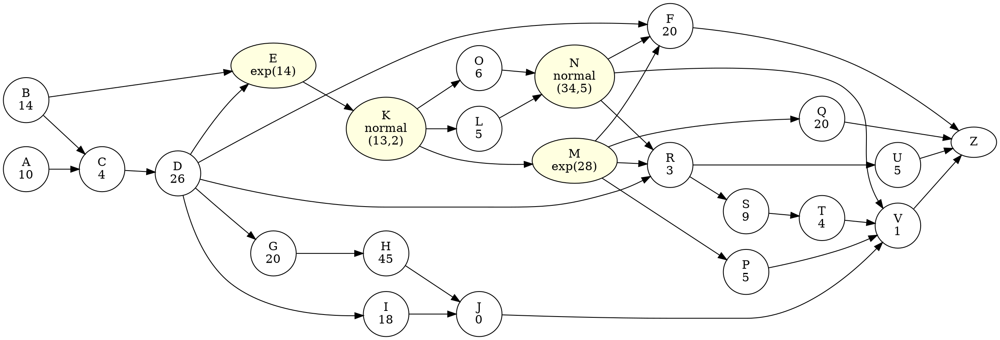
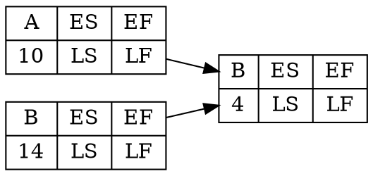
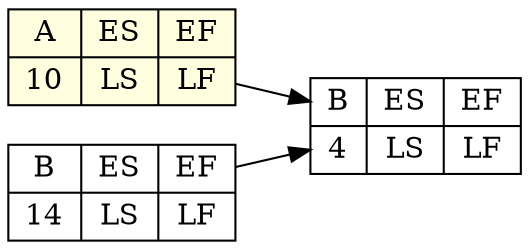
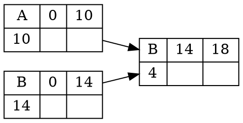

Görevler | Tanım | Süre (hafta) | Öncelik İlişkisi | 
---------|-------|--------------|------------------|
A | Pazar araştırması | 10 | 
B | Dış gelişim odak grubu | 14 | 
C | Özellik seçimi | 4 | A,B | 
D | Yazılım mühendisliği | 26 | C | 
E | İşletim sistemi geliştirme | **exp(14)** | D,B | 
F | Reklam kampanyası | 20 | D,M,N | 
G | Tedarikçi seçimi ve anlaşma | 20 | D | 
H | Parça envanteri takviyesi | 45 | G | 
I | Montaj tesisi kurma | 18 | D | 
J | Tamamlanmış ürün envanteri takviyesi | 7 | I,H | 
K | Kütüphane & Programlayıcı alet takımı geliştirme | **normal(13,2)** | E | 
L | Dış gelişim destek kurulumu | 5 | K | 
M | İç oyun geliştirme  | **exp(28)** | K | 
N | Dış oyun geliştirme | **normal(34,5)** | L,O | 
O | Platform tanıtımı | 6 | K | 
P | Yayın evi seçimi ve anlaşması | 5 | M | 
Q | Web sitesi kurulumu | 20 | M | 
R | Tanıtım metaryeli tasarımı | 3 | D,M,N | 
S | Dağıtım kanallarının geliştirilmesi ve anlaşması | 9 | R | 
T | Nakliye seçimi ve anlaşması | 4 | S | 
U | Etkinlik organizasyonunun başlatılması | 5 | R | 
V | Yazılım & Donanım sevkiyatı | 1 | J,T,P,N | 
Z | Piyasaya sürme  | 0 | V,U,Q,F |

```plantuml
@startgantt
[Pazar araştırması] lasts 10 days
[Dış gelişim odak grubu] lasts 14 days
[Özellik seçimi] lasts 4 days
[Yazılım mühendisliği] lasts 26 days
[İşletim sistemi geliştirme] lasts 14 days
[Reklam kampanyası] lasts 20 days
[Tedarikçi seçimi ve anlaşma] lasts 20 days
[Parça envanteri takviyesi] lasts 45 days
[Montaj tesisi kurma] lasts 18 days
[Tamamlanmış ürün envanteri takviyesi] lasts 7 days
[Kütüphane & Programlayıcı alet takımı geliştirme] lasts 13 days
[Dış gelişim destek kurulumu] lasts 5 days
[İç oyun geliştirme] lasts 28 days
[Dış oyun geliştirme] lasts 34 days
[Platform tanıtımı] lasts 6 days
[Yayın evi seçimi ve anlaşması] lasts 5 days
[Web sitesi kurulumu] lasts 20 days
[Tanıtım metaryeli tasarımı] lasts 3 days
[Dağıtım kanallarının geliştirilmesi ve anlaşması] lasts 9 days
[Nakliye seçimi ve anlaşması] lasts 4 days
[Etkinlik organizasyonunun başlatılması] lasts 5 days
[Yazılım & Donanım sevkiyatı] lasts 1 days
[Piyasaya sürme ] lasts 0 days

[Özellik seçimi] starts at [Pazar araştırması]'s end
[Özellik seçimi] starts at [Dış gelişim odak grubu]'s end
[Yazılım mühendisliği] starts at [Özellik seçimi]'s end

[İşletim sistemi geliştirme] starts at [Özellik seçimi]'s end
[İşletim sistemi geliştirme] starts at [Yazılım mühendisliği]'s end



[Tedarikçi seçimi ve anlaşma] starts at [Yazılım mühendisliği]'s end

[Parça envanteri takviyesi] starts at [Tedarikçi seçimi ve anlaşma]'s end

[Montaj tesisi kurma] starts at [Yazılım mühendisliği]'s end

[Tamamlanmış ürün envanteri takviyesi] starts at [Montaj tesisi kurma]'s end
[Tamamlanmış ürün envanteri takviyesi] starts at [Parça envanteri takviyesi]'s end

[Kütüphane & Programlayıcı alet takımı geliştirme] starts at [İşletim sistemi geliştirme]'s end

[Dış gelişim destek kurulumu] starts at [Kütüphane & Programlayıcı alet takımı geliştirme]'s end

[İç oyun geliştirme] starts at [Kütüphane & Programlayıcı alet takımı geliştirme]'s end

[Reklam kampanyası] starts at [Yazılım mühendisliği]'s end
[Reklam kampanyası] starts at [İç oyun geliştirme]'s end

[Dış oyun geliştirme] starts at [Dış gelişim destek kurulumu]'s end
[Dış oyun geliştirme] starts at [Dış gelişim destek kurulumu]'s end

[Reklam kampanyası] starts at [Dış oyun geliştirme]'s end


@endgantt
```

---

